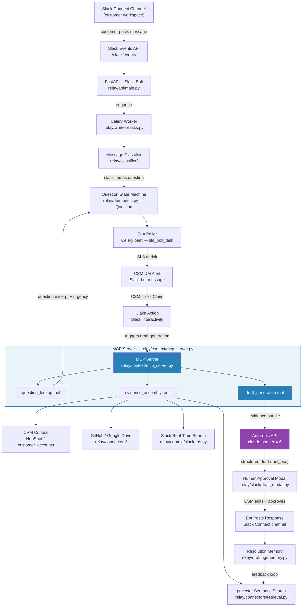

# RELAY Architecture

## Full Data Flow



## Layer Summary

| Layer | What it does | Key files |
|-------|-------------|-----------|
| **Slack surface** | Receives Events API webhooks, slash commands, interactivity, OAuth | `relay/api/main.py`, `relay/slack/` |
| **Ingestion worker** | Classifies messages, creates Question rows, drives state machine | `relay/worker/tasks.py`, `relay/classifier/` |
| **SLA poller** | Celery beat job — fires alerts before response deadlines | `relay/worker/tasks.py` |
| **MCP Server** | Governed interface between Claude and RELAY's data tools | `relay/context/mcp_server.py` |
| **Context service** | Fetches question/account context, assembles evidence bundles | `relay/context/service.py`, `relay/context/contracts.py` |
| **Retrieval** | pgvector ANN search over indexed knowledge entries | `relay/connectors/retrieval.py` |
| **Connectors** | Sync GitHub/Google Drive docs; HubSpot CRM; Slack RTS | `relay/connectors/`, `relay/context/slack_rts.py` |
| **Draft generator** | Calls Anthropic API with evidence bundle via `draft_generation` MCP tool | `relay/drafting/generator.py` |
| **Approval modal** | Block Kit modal for CSM review, edit, and one-click send | `relay/slack/draft_modal.py` |
| **Resolution memory** | Stores approved Q+A pairs; feeds back into retrieval | `relay/drafting/memory.py` |

## MCP as the Integration Layer

```
Celery task (drafting_tasks.py)
  └─▶ draft_generation_tool()       ← MCP tool function
        ├─▶ evidence_assembly_tool() ← assembles pgvector + CRM + Slack RTS sources
        │     ├─▶ question_lookup_tool()
        │     ├─▶ pgvector retrieve()
        │     ├─▶ HubSpot account context
        │     └─▶ Slack Real-Time Search
        └─▶ generate_draft()         ← calls Anthropic API, saves Draft row
```

All draft generation routes through the MCP tool boundary. External clients (Claude Code, MCP inspector) can invoke the same `draft_generation` tool directly.

## Tenant Isolation

- PostgreSQL RLS (`SET LOCAL app.current_workspace_id`) on every session
- All `workspace_id` columns are UUIDs, never cross-joined
- Bot tokens, CRM tokens, and Slack search tokens encrypted with AES-256-GCM workspace DEKs
- Workspace data purge via `/relay delete-workspace-data` cascades through all tenant tables
